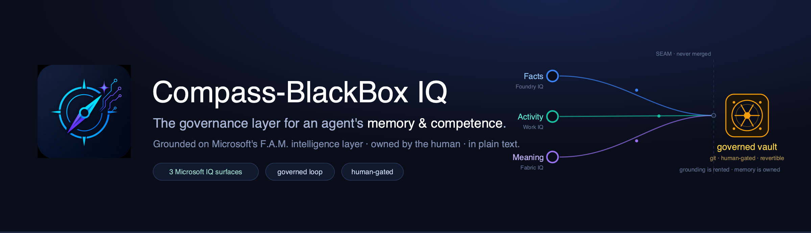
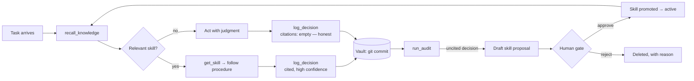

<p align="center"></p>

<p align="center"><i>Agents League @ AI Skills Fest 2026 · Reasoning Agents track · Microsoft Foundry + MCP</i></p>

---

## Compass-BlackBox IQ Thesis

Microsoft's stack governs an **autonomous agent's** permissions, actions, and grounding — identity and policy (Agent 365),[^build2026] approval gates and spend caps (orchestration platforms),[^omnigent] and the intelligence layer it reasons over. **Compass-BlackBox IQ governs the layer no one else does: memory and competence.** What does your agent know? What did it do, and why? How does it improve — and who approved that?

> **Who it's for:** autonomous agents on Microsoft's stack — built for **Microsoft Scout**, and portable to any MCP-capable agent runtime. It governs what the agent *knows, did, and learned* — optimized for agents that act and learn across many steps. A chatbot or copilot can use it too; it just isn't where the payoff is greatest.

It is three parts working as one system:

- **Governed memory** — an agent's decisions, skills, and knowledge as plain Markdown in a git repo *the human owns*. Every action is an immutable, server-cited decision record; the git log **is** the audit trail. **Agents propose; humans promote** — and the blackbox is append-only, so behavior is revertible but history is not.
- **F.A.M. grounding** — the agent reasons over Microsoft's intelligence layer as three orthogonal lenses: **Foundry IQ (Facts) · Work IQ (Activity) · Fabric IQ (Meaning)** — read-only, source-tagged, and *never merged* into governed memory.
- **A competence engine** — an audit mines the decision records and drafts new skills from the notes the agent overlooked; a human approves them. Competence is developed the way a researcher builds theory: grounded theory's **constant comparative analysis** (fit · work · saturation).

Not a memory store, and not a logger — **a governance layer that makes an autonomous agent's competence auditable, attributable, and revertible, in 100% inspectable plain text.**

---

## The idea

An agent's entire memory — skills, knowledge, decisions — lives as plain Markdown in a git repository the human owns. Obsidian-compatible. Every memory write is a commit.

- **Blackbox**: every action produces an immutable decision record — plan, evidence cited, actions, outcome, confidence. The git log *is* the audit trail.
- **Compass**: audit heuristics mine the decision records. Uncited decisions (the agent freelanced) automatically become *draft skill proposals*. A human approves or rejects. Approved skills change the agent's future behavior — auditable, attributable, revertible.

**The invariant (enforced by the server, not by prompt):** the agent's only write paths are decision records and proposals. Promotion into active skills/knowledge happens exclusively through the human-gated `approve_proposal`. **Agents propose; humans promote.** `git revert` is memory rollback — but it only applies to skills and knowledge: decision records are append-only even for humans. **Behavior is revertible; history is not.**

## The loop



## Architecture

```
Foundry Agent ("GM Louis")  ──MCP (streamable HTTP, auth-gated)──►  BlackBox IQ (GGR) server (TypeScript)
   multi-step reasoning      11 tools                                │
        │                                                            ▼
        │                          Vault (git repo, Markdown) — GOVERNED MEMORY
        │                          decisions · skills · knowledge · proposed
        ▼
  F.A.M. grounding — read-only, source-tagged, never merged into the vault:
   · Foundry IQ — Facts     (Azure AI Search KB)          [iq:]      ─ live
   · Work IQ    — Activity  (M365 Copilot / Work IQ GW)   [work:]    ─ live
   · Fabric IQ  — Meaning   (RDF/OWL Fabric IQ ontology)  [fabric:]  ─ roadmap

Human ◄── Obsidian (live graph view) ◄── Vault     approves / rejects / reverts
```

Grounding (F.A.M.) is read-only and kept strictly **orthogonal** to the vault —
three lenses, each source-tagged, never merged into the governed memory the human
owns. The MCP endpoint is **auth-gated** (bearer token) so the tunnel can't be
called anonymously. See `docs/architecture.svg` and `docs/fam-and-the-engine.md`.

## Tools (MCP surface)

| Tool | Caller | Purpose |
|---|---|---|
| `recall_knowledge` | agent | keyword recall over knowledge + skills |
| `get_skill` | agent | fetch a skill's full procedure |
| `log_decision` | agent | write the blackbox record (only agent write path) |
| `run_audit` | human-triggered (via agent) | 3 heuristics: uncited decisions, stale skills, low-confidence repeats. For an uncited decision, Compass re-runs recall over the task and drafts a proposal that cites the existing notes the agent failed to consult — the draft is derived from real vault content, not invented |
| `list_proposals` | agent | show drafts awaiting review |
| `approve_proposal` | **human gate** | promote proposal → active memory |
| `reject_proposal` | **human gate** | delete with reason |
| `revert_memory` | **human gate** | `git revert` a `[compass]`/`[human]` commit. Refuses `[blackbox]` commits: the flight recorder is append-only |
| `memory_log` | anyone | the audit trail itself |
| `ground_foundry_iq` | agent | **read-only IQ grounding — Facts.** Microsoft Foundry IQ (Azure AI Search KB) for institutional facts (vendor master, org directory, handbook), tagged `source:foundry-iq` / `[iq:]`. Held separate from vault memory: never merged with `recall_knowledge`, never cited as a vault note |
| `ground_work_iq` | agent | **read-only IQ grounding — Activity.** Live calls to the **Microsoft Work IQ Gateway** (M365 Copilot Chat API) for the signed-in user's organizational context (mail, calendar, people), tagged `source:work-iq` / `[work:]`. Per-user (the token scopes what it sees); same orthogonality contract |

### Microsoft IQ grounding

The grounding model is **F.A.M. — Facts · Activity · Meaning = grounded truth**:
Foundry IQ (Facts), Work IQ (Activity), Fabric IQ (Meaning). Three read-only
lenses on the enterprise world, each earning a *distinct* citation, none merged
into governed memory. Competence over that world is measured with grounded
theory's **constant comparative analysis** — acceptance tests *fit* and *work*.
See **[`docs/fam-and-the-engine.md`](docs/fam-and-the-engine.md)**.

Two of the three lenses are **live**; the third is authored and wired as an honest next step:

- **Foundry IQ (Facts)**[^foundryiq] — live. An Azure AI Search knowledge base of
  institutional reference (vendor master, org directory, handbook) via
  `ground_foundry_iq`, tagged `source:foundry-iq` / `[iq:]`.
- **Work IQ (Activity)** — live. Real calls to the **Microsoft Work IQ Gateway**
  (M365 Copilot Chat API) for the signed-in user's work context via
  `ground_work_iq`, tagged `source:work-iq` / `[work:]`. Per-user: the user's token
  scopes exactly what it can see.
- **Fabric IQ (Meaning)** — a business ontology (RDF/OWL, in Microsoft's Fabric IQ
  format) modeling entities and relationships; see
  `foundry/knowledge-sources/fabric-iq/`. Live wiring (a Fabric Data Agent or the
  Fabric IQ Ontology MCP, in a Fabric tenant) is the documented next step — **not
  claimed as live.**

All grounding is held strictly **orthogonal to the vault**: source-tagged, never
merged or re-ranked with `recall_knowledge`, never able to override what a human
approved. The split is the thesis in one line — **Microsoft governs permissions
and grounding; Compass-BlackBox IQ governs memory and competence.** The MCP
endpoint is **auth-gated** (bearer token) so the public tunnel can't be called
anonymously now that grounding can reach a per-user token.

## Quickstart

```bash
cd server && npm install && npm run build
node ../demo/seed-vault.mjs            # generates the demo vault (it is not committed —
                                       # it contains its own inner git repo, recreated deterministically)
npm start                              # stdio (Claude Desktop / MCP Inspector)
MODE=http npm start                    # streamable HTTP :3000/mcp (Foundry)
node ../demo/smoke-test.mjs            # full loop, no LLM required — exits 0 only if every check passes
```

Wire a Foundry Agent Service agent to `https://<host>/mcp` with the
instructions in `agent/gm-louis-instructions.md`, point Obsidian at `vault/`,
and run the demo script in `demo/`.

## How this maps to the judging criteria

- **Reasoning / multi-step (20%)** — the full loop on video: plan → recall → act → log → audit → propose → human approve → governed re-run of the same input. The improvement step is itself reasoning you can read: the audit's proposal cites the exact notes the agent overlooked.
- **Reliability & safety (20%)** — the invariant is enforced in the tool layer, not the prompt: no tool writes active memory; promotion requires the human gate; `revert_memory` refuses to rewrite the blackbox; honest empty citations are a designed signal, never "fixed" server-side; all vault writes are serialized and committed. Read-only **Foundry IQ** grounding is kept orthogonal to the vault — own provenance, never merged or able to override governed memory.
- **Accuracy (20%)** — citations are server-verified: ids that don't resolve to a real note are flagged `citations_unresolved` in the record (never silently dropped), and `cite_count`/`last_cited` are updated server-side from logged citations, not agent claims.
- **Creativity (15%)** — agent memory as a human-owned git repo: the git log is the audit trail, `git revert` is rollback, Obsidian is the UI.
- **UX (15%)** — plain Markdown, live graph view, one-call approval; zero new interfaces to learn.

## Where governed memory matters

Three layers govern an autonomous agent. The first two already have a control plane. The third — *what it knows, did, and learned* — doesn't. That's the layer Compass-BlackBox IQ builds.

| Layer | Governs | Control plane |
|---|---|---|
| Permissions & security | identity, policy, who/what the agent may touch | Agent 365 — Entra · Defender · Purview[^build2026] |
| Actions | approve / block / pause per action, spend, tools | orchestration platforms[^omnigent] |
| **Memory & competence** | **what it knows, did & learned — and who approved it** | **Compass-BlackBox IQ** |

The third layer isn't optional when:

- **Regulated decisions** (healthcare, finance, legal) — every action needs provenance, human-gated capability change, and revocable memory.
- **Multi-agent fleets** — when one agent's learned skill propagates to the rest, a human must be able to see, approve, and revert what spreads.
- **Long-running autonomy** — an always-on agent's competence drifts; the blackbox + audit make the drift visible, and the human gate keeps it accountable.

Same pattern every time: **memory you can read, competence you can revert** — in 100% inspectable plain text.

## The bigger picture — one platform, three layers

One repo, three layers — the full lifecycle of an autonomous agent's competence: **build** a skill, **reason** with it, **govern** the outcome.

- **Compass Rose** · `compass-rose/` — **builds** role-aligned skills: a CLI with 8 executive archetypes, plus the no-YAML **Compass Rose web app** (`compass-rose/web/`, powered by GM Louis) — [*persona → preview → one-click install*](docs/compass-rose-skill-lifecycle.md).
- **GM Louis** · `agent/` — **reasons** over the governed loop: the agent's contract that turns a task into cited decision records (shipped alongside *Freelance GM*, the ungoverned "before" for contrast).
- **BlackBox IQ — GGR** · `server/` + `demo/` — **governs, grounds & records**: the MCP server enforces the human-gated invariant (**G**overnance), serves read-only F.A.M. grounding — Foundry IQ · Work IQ · Fabric IQ (**G**rounding), and writes the append-only blackbox + audit (**R**ecorder).

One principle end to end — **agents propose, humans promote**. Build → reason → govern, in 100% inspectable plain text.

## Roadmap

What's shipped here is the foundation — the full **GGR** loop (Governance · Grounding · Recorder),
with F.A.M. grounding live on **Foundry IQ** (Facts) and **Work IQ** (Activity). The platform extends
along three lines:

- **Complete F.A.M.** — **Fabric IQ** (Meaning) ships today as an authored, Microsoft-format ontology;
  wire it live so the agent grounds on business *meaning*, not just facts and activity.
- **Preventive governance** — today the blackbox governs *after* the fact (log, score, explain). Add
  real-time blocking of non-compliant actions via the open **Agent Control Specification**[^acs] and
  **ASSERT**-style evals[^assert] over the decision record.
- **Fleet propagation** — promote a human-approved skill across a multi-agent fleet through one gate,
  with per-agent provenance for what spread and why.

Framework-agnostic and open source — it *consumes* Microsoft's trust stack rather
than duplicating it, which makes it complementary, not competitive.

## Stack

TypeScript · MCP SDK (streamable HTTP + stdio) · Microsoft Foundry Agent Service · Foundry IQ (Azure AI Search) · Work IQ (M365 Copilot Gateway) · Fabric IQ (RDF/OWL ontology) · Flask · simple-git · gray-matter · Obsidian-compatible vault

---

Built solo by [Jeremy Gracey](https://jeremygracey.ai) · [GitHub](https://github.com/JeremyGracey-AI)

[^build2026]: Daigle, Kyle. "Microsoft Build 2026: Be Yourself at Work." *The Official Microsoft Blog*, Microsoft, 2 June 2026, https://blogs.microsoft.com/blog/2026/06/02/microsoft-build-2026-be-yourself-at-work/. Accessed 13 June 2026.

[^foundryiq]: Daigle, Kyle. "Microsoft Build 2026: Be Yourself at Work — Foundry IQ." *The Official Microsoft Blog*, Microsoft, 2 June 2026, https://aka.ms/BuildFoundryIQ. Accessed 13 June 2026.

[^omnigent]: *Omnigent: Meta-Orchestration for AI Agents.* omnigent-ai, GitHub, 13 June 2026, https://github.com/omnigent-ai/omnigent. Accessed 13 June 2026. (Representative of action-layer agent governance — approval gates, spend caps, tool restrictions.)

[^acs]: Microsoft. "Agent Control Specification: Runtime Governance for AI Agents." *Microsoft Command Line*, 2 June 2026, https://commandline.microsoft.com/agent-control-specification-runtime-governance/. Accessed 13 June 2026.

[^assert]: Microsoft. "ASSERT: Adaptive Spec-driven Scoring for Evaluation and Regression Testing." *Microsoft Command Line*, 2 June 2026, https://commandline.microsoft.com/assert-written-intent-executable-evals/. Accessed 13 June 2026.
